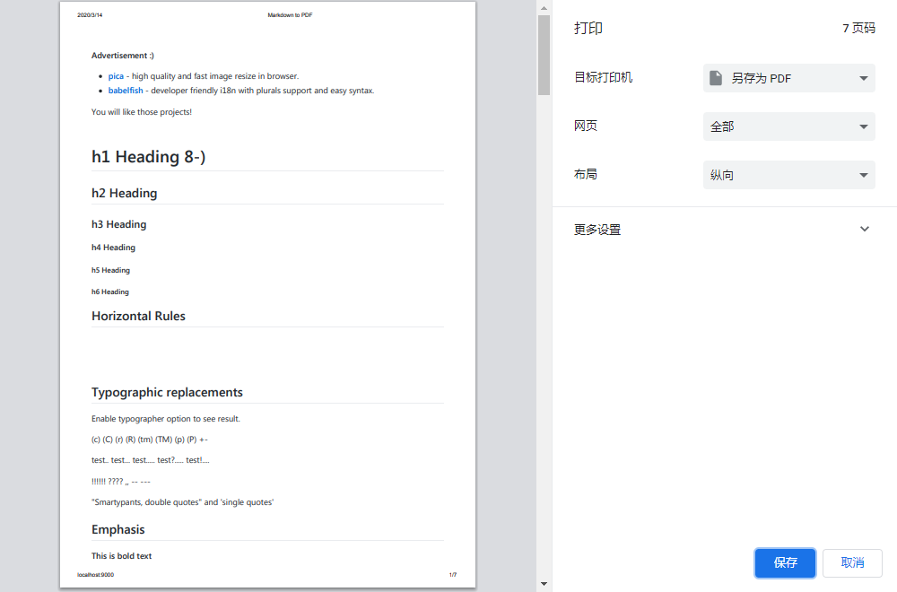

# markdown-pdf

**死简单**且**高质量**的`Markdown`转`PDF`工具

## 快速开始

- `yarn`
- `yarn start`

用`Chrome`打开`http://localhost:9000`，修改`routes/home.md`，然后刷新当前页面查看变更。

## 导出PDF

当页面符合你的审美要求时，就可以导出了：

`鼠标右键`-`打印(P)`-目标打印机选择`另存为PDF`

## License

**markdown-pdf** 在FSB协议下发行，更多详情请查看[LICENSE](./LICENSE)
